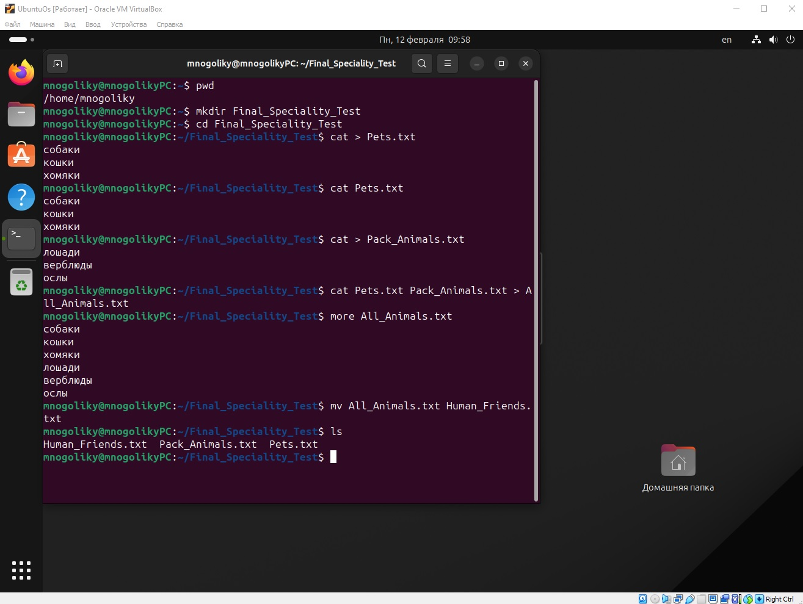
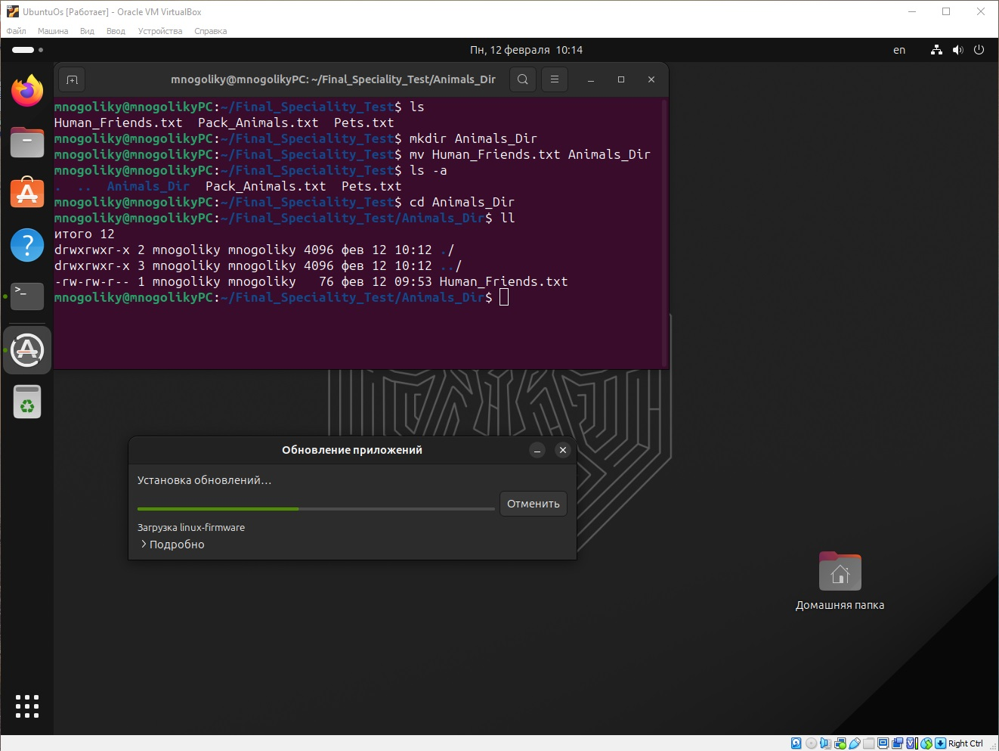
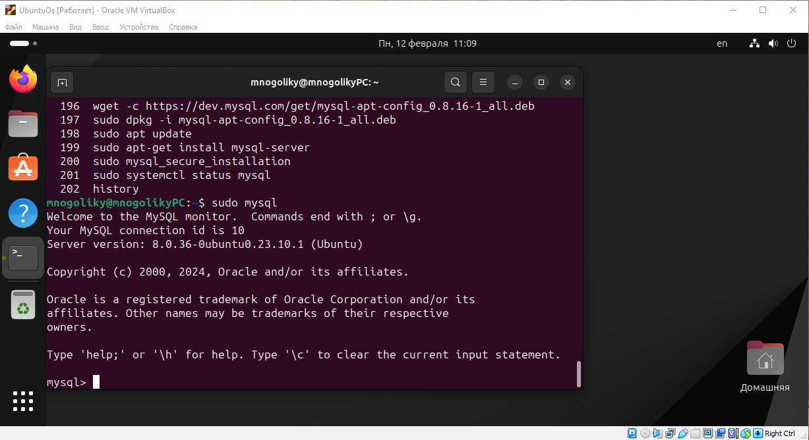
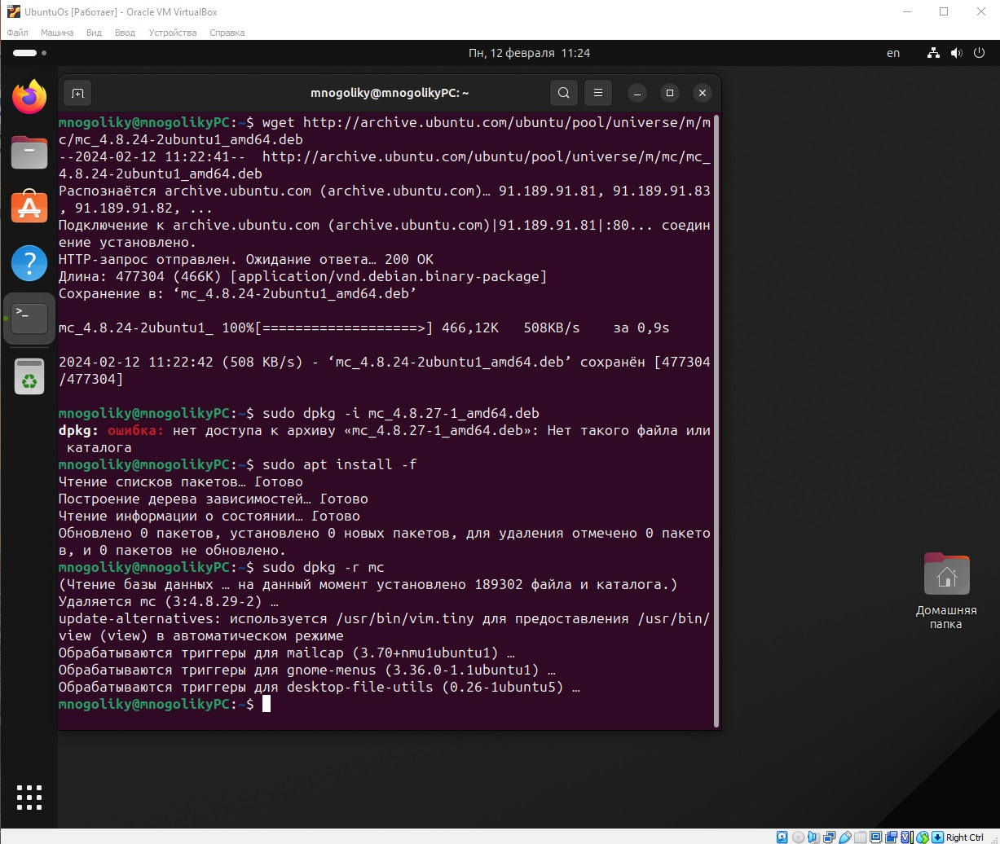
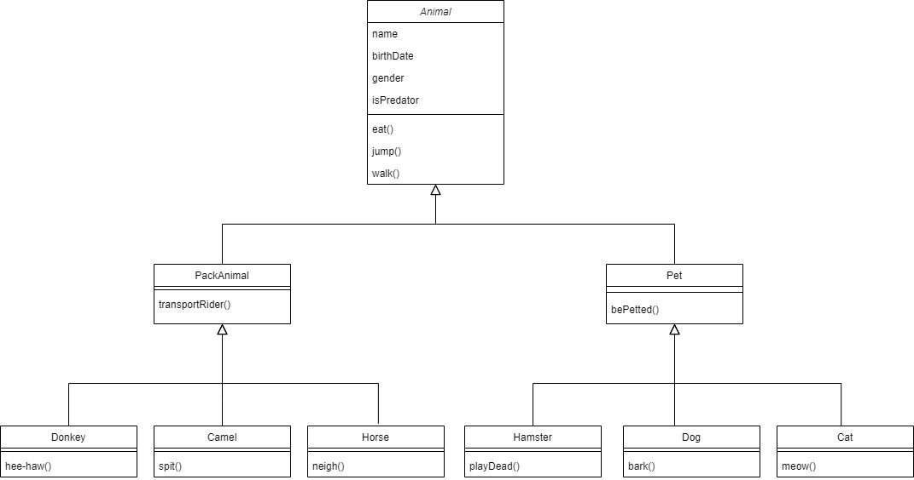

# Итоговая контрольная работа по блоку специализация (Николай Гаврилов, февраль 2024 года)

__Информация о проекте__

Необходимо организовать систему учета для питомника в котором живут
домашние и вьючные животные.
___

## Операционные системы и виртуализация (Linux)
\
__1. Использование команды cat в Linux__

Создать два текстовых файла: "Pets"(Домашние животные) и "Pack
animals"(вьючные животные), используя команду `cat` в терминале Linux. В
первом файле перечислить собак, кошек и хомяков. Во втором — лошадей,
верблюдов и ослов.
Объединить содержимое этих двух файлов в один и просмотреть его
содержимое.
Переименовать получившийся файл в "Human Friends".
Пример конечного вывода после команды “ls” :
Desktop Documents Downloads HumanFriends.txt Music PackAnimals.txt
Pets.txt Pictures Videos



__2. Работа с директориями в Linux__

Создать новую директорию и переместить туда файл "Human Friends".



__3. Работа с MySQL в Linux. “Установить MySQL на вашу вычислительную
машину”__

Подключить дополнительный репозиторий MySQL и установить один из пакетов из этого репозитория.



__4. Управление deb-пакетами__

Установить и затем удалить deb-пакет, используя команду `dpkg`.



__5. История команд в терминале Ubuntu__

Сохранить и выложить историю ваших терминальных команд в Ubuntu.

```
mnogoliky@mnogolikyPC:~$ history
    178  mkdir Final_Speciality_Test
    179  cd Final_Speciality_Test
    180  cat > Pets.txt
    181  cat Pets.txt
    182  cat > Pack_Animals.txt
    183  cat Pets.txt Pack_Animals.txt > All_Animals.txt
    184  more All_Animals.txt
    185  mv All_Animals.txt Human_Friends.txt
    186  ls
    187  clear
    188  ls
    189  mkdir Animals_Dir
    190  mv Human_Friends.txt Animals_Dir
    191  ls - a
    192  cd Animals_Dir
    193  ll
    194  history
    195  clear
    196  wget -c https://dev.mysql.com/get/mysql-apt-config_0.8.16-1_all.deb
    197  sudo dpkg -i mysql-apt-config_0.8.16-1_all.deb
    198  sudo apt update
    199  sudo apt-get install mysql-server
    200  sudo mysql_secure_installation
    201  sudo systemctl status mysql
    202  history
    203  sudo mysql
    204  exit
    205  history
    206  clear
    207  wget http://archive.ubuntu.com/ubuntu/pool/universe/m/mc/mc_4.8.24-2ubuntu1_amd64.deb
    208  sudo dpkg -i mc_4.8.27-1_amd64.deb
    209  sudo apt install -f
    210  sudo dpkg -r mc
    211  history
```
В формате: Файла с ФИО, датой сдачи, номером группы(или потока)

___
## Объектно-ориентированное программирование

__6. Диаграмма классов__

Создать диаграмму классов с родительским классом "Животные", и двумя
подклассами: "Pets" и "Pack animals".
В составы классов которых в случае Pets войдут классы: собаки, кошки,
хомяки, а в класс Pack animals войдут: Лошади, верблюды и ослы.
Каждый тип животных будет характеризоваться (например, имена, даты
рождения, выполняемые команды и т.д)
Диаграмму можно нарисовать в любом редакторе, такими как Lucidchart,
Draw.io, Microsoft Visio и других.



__7. Работа с MySQL (Задача выполняется в случае успешного выполнения
задачи “Работа с MySQL в Linux. “Установить MySQL на вашу машину”)__

7.1 После создания диаграммы классов в 6 пункте, в 7 пункте база данных
"Human Friends" должна быть структурирована в соответствии с этой
диаграммой. Например, можно создать таблицы, которые будут
соответствовать классам "Pets" и "Pack animals", и в этих таблицах будут поля, которые характеризуют каждый тип животных (например, имена, даты
рождения, выполняемые команды и т.д.).

7.2 В ранее подключенном MySQL создать базу данных с названием
"Human Friends".
````
-- Создаем базу данных humanfriends
DROP DATABASE IF EXISTS humanfriends;
CREATE DATABASE humanfriends;
````
Создать таблицы, соответствующие иерархии из вашей диаграммы
классов.
````
USE humanfriends;

-- Создаем таблицы отдельных видов животных, таблицы питомцев и вьюточных животных, таблицу всех животных, собранных вместе
DROP TABLE IF EXISTS humanfriends.cats;
CREATE TABLE humanfriends.cats (
  id INT NOT NULL AUTO_INCREMENT,
  name VARCHAR(45) NOT NULL,
  birthDate DATE NOT NULL,
  gender CHAR(1) NOT NULL,
  isPredator TINYINT NOT NULL,
  commands TEXT NOT NULL,
  PRIMARY KEY (id));
  
DROP TABLE IF EXISTS humanfriends.dogs;
CREATE TABLE humanfriends.dogs (
  id INT NOT NULL AUTO_INCREMENT,
  name VARCHAR(45) NOT NULL,
  birthDate DATE NOT NULL,
  gender CHAR(1) NOT NULL,
  isPredator TINYINT NOT NULL,
  commands TEXT NOT NULL,
  PRIMARY KEY (id));
  
DROP TABLE IF EXISTS humanfriends.hamsters;
CREATE TABLE humanfriends.hamsters (
  id INT NOT NULL AUTO_INCREMENT,
  name VARCHAR(45) NOT NULL,
  birthDate DATE NOT NULL,
  gender CHAR(1) NOT NULL,
  isPredator TINYINT NOT NULL,
  commands TEXT NOT NULL,
  PRIMARY KEY (id));
  
DROP TABLE IF EXISTS humanfriends.horses;
CREATE TABLE humanfriends.horses (
  id INT NOT NULL AUTO_INCREMENT,
  name VARCHAR(45) NOT NULL,
  birthDate DATE NOT NULL,
  gender CHAR(1) NOT NULL,
  isPredator TINYINT NOT NULL,
  commands TEXT NOT NULL,
  PRIMARY KEY (id));
  
DROP TABLE IF EXISTS humanfriends.donkeys;
CREATE TABLE humanfriends.donkeys (
  id INT NOT NULL AUTO_INCREMENT,
  name VARCHAR(45) NOT NULL,
  birthDate DATE NOT NULL,
  gender CHAR(1) NOT NULL,
  isPredator TINYINT NOT NULL,
  commands TEXT NOT NULL,
  PRIMARY KEY (id));

DROP TABLE IF EXISTS humanfriends.camels;
CREATE TABLE humanfriends.camels (
  id INT NOT NULL AUTO_INCREMENT,
  name VARCHAR(45) NOT NULL,
  birthDate DATE NOT NULL,
  gender CHAR(1) NOT NULL,
  isPredator TINYINT NOT NULL,
  commands TEXT NOT NULL,
  PRIMARY KEY (id));
  
DROP TABLE IF EXISTS humanfriends.pets;
CREATE TABLE humanfriends.pets (
  id INT NOT NULL UNIQUE AUTO_INCREMENT PRIMARY KEY,
  subtype VARCHAR(45) NOT NULL,
  name VARCHAR(45) NOT NULL,
  birthDate DATE NOT NULL,
  gender CHAR(1) NOT NULL,
  isPredator TINYINT NOT NULL,
  commands TEXT NOT NULL);
  
DROP TABLE IF EXISTS humanfriends.packanimals;
CREATE TABLE humanfriends.packanimals (
  id INT NOT NULL UNIQUE AUTO_INCREMENT PRIMARY KEY,
  subtype VARCHAR(45) NOT NULL,
  name VARCHAR(45) NOT NULL,
  birthDate DATE NOT NULL,
  gender CHAR(1) NOT NULL,
  isPredator TINYINT NOT NULL,
  commands TEXT NOT NULL);
  
DROP TABLE IF EXISTS humanfriends.animals;
CREATE TABLE humanfriends.animals (
  id INT NOT NULL UNIQUE AUTO_INCREMENT PRIMARY KEY,
  type VARCHAR(45) NOT NULL,
  subtype VARCHAR(45) NOT NULL,
  name VARCHAR(45) NOT NULL,
  birthDate DATE NOT NULL,
  gender CHAR(1) NOT NULL,
  isPredator TINYINT NOT NULL,
  commands TEXT NOT NULL);
````
Заполнить таблицы данными о животных, их командах и датах
рождения.
````
-- Заполняем таблицы животными 
INSERT INTO humanfriends.cats (id, name, birthDate, gender, isPredator, commands)
VALUES 
('1', 'Katya', '2000-03-01', 'f', '1', 'eat, jump, walk, bePetted, meow'),
('2', 'Sasha', '2006-09-13', 'f', '1', 'eat, jump, walk, bePetted, meow'),
('3', 'Seva', '2015-10-10', 'm', '1', 'eat, jump, walk, bePetted, meow');

INSERT INTO humanfriends.dogs (id, name, birthDate, gender, isPredator, commands)
VALUES 
('1', 'Bobik', '2011-11-01', 'm', '1', 'eat, jump, walk, bePetted, bark'),
('2', 'Rex', '2007-07-17', 'm', '1', 'eat, jump, walk, bePetted, bark'),
('3', 'Mukhtar', '2022-04-04', 'm', '1', 'eat, jump, walk, bePetted, bark');

INSERT INTO humanfriends.hamsters (id, name, birthDate, gender, isPredator, commands)
VALUES 
('1', 'Elvin', '2023-06-12', 'm', '0', 'eat, jump, walk, bePetted, playDead'),
('2', 'Ryzhik', '2024-01-11', 'm', '0', 'eat, jump, walk, bePetted, playDead'),
('3', 'Vasilisa', '2024-02-04', 'f', '0', 'eat, jump, walk, bePetted, playDead');

INSERT INTO humanfriends.horses (id, name, birthDate, gender, isPredator, commands)
VALUES 
('1', 'Servilat', '2020-03-20', 'm', '0', 'eat, jump, walk, transportRider, neigh'),
('2', 'Lyubimka', '2018-02-14', 'f', '0', 'eat, jump, walk, transportRider, neigh');

INSERT INTO humanfriends.donkeys (id, name, birthDate, gender, isPredator, commands)
VALUES 
('1', 'Donkey', '2012-06-02', 'm', '0', 'eat, jump, walk, transportRider, hee-haw'),
('2', 'Hee-Haw', '2017-08-27', 'm', '0', 'eat, jump, walk, transportRider, hee-haw'),
('3', 'Skotinka', '2020-05-05', 'f', '0', 'eat, jump, walk, transportRider, hee-haw');

INSERT INTO humanfriends.camels (id, name, birthDate, gender, isPredator, commands)
VALUES 
('1', 'Gorbachev', '2021-12-11', 'm', '0', 'eat, jump, walk, transportRider, spit'),
('2', 'Alladin', '2016-04-14', 'm', '0', 'eat, jump, walk, transportRider, spit'),
('3', 'Arabskaya Noch', '2009-01-02', 'f', '0', 'eat, jump, walk, transportRider, spit');

-- Заполняем таблицу домашних животных через селект-запрос с объединением (к кошкам, собакам, хомякам)
SET @id = 0;
INSERT INTO humanfriends.pets
SELECT @id := @id + 1 AS id, 'Cat' AS subtype, cats.name, cats.birthdate, cats.gender, cats.isPredator, cats.commands
FROM humanfriends.cats
UNION 
SELECT @id := @id + 1 AS id, 'Dog' AS subtype, dogs.name, dogs.birthdate, dogs.gender, dogs.isPredator, dogs.commands
FROM humanfriends.dogs
UNION 
SELECT @id := @id + 1 AS id, 'Hamster' AS subtype, hamsters.name, hamsters.birthdate, hamsters.gender, hamsters.isPredator, hamsters.commands
FROM humanfriends.hamsters;
````
Удалить записи о верблюдах и объединить таблицы лошадей и ослов.
````
-- Удаляем записи о верблюдах в соответствии с заданием, выключаем на время этой операции безопасный режим (например, при ошибке в работе с MySQL Workbench) и включаем снова
SET SQL_SAFE_UPDATES = 0;
DELETE FROM humanfriends.camels;
SET SQL_SAFE_UPDATES = 1;

-- Объединяем лошадей и ослов в единую таблицу
SET @id = 0;
INSERT INTO humanfriends.packanimals
SELECT @id := @id + 1 AS id, 'Horse' AS subtype, horses.name, horses.birthdate, horses.gender, horses.isPredator, horses.commands
FROM humanfriends.horses
UNION 
SELECT @id := @id + 1 AS id, 'Donkey' AS subtype, donkeys.name, donkeys.birthdate, donkeys.gender, donkeys.isPredator, donkeys.commands
FROM humanfriends.donkeys;
````
Создать новую таблицу для животных в возрасте от 1 до 3 лет и вычислить
их возраст с точностью до месяца.
````

````
Объединить все созданные таблицы в одну, сохраняя информацию о
принадлежности к исходным таблицам.