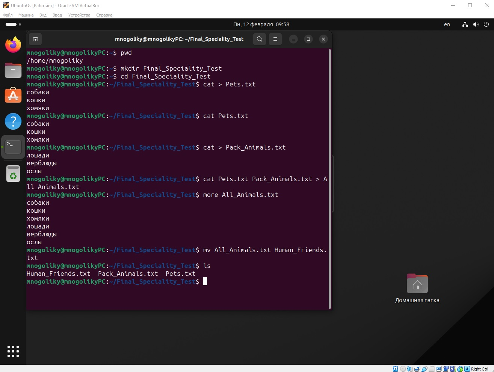
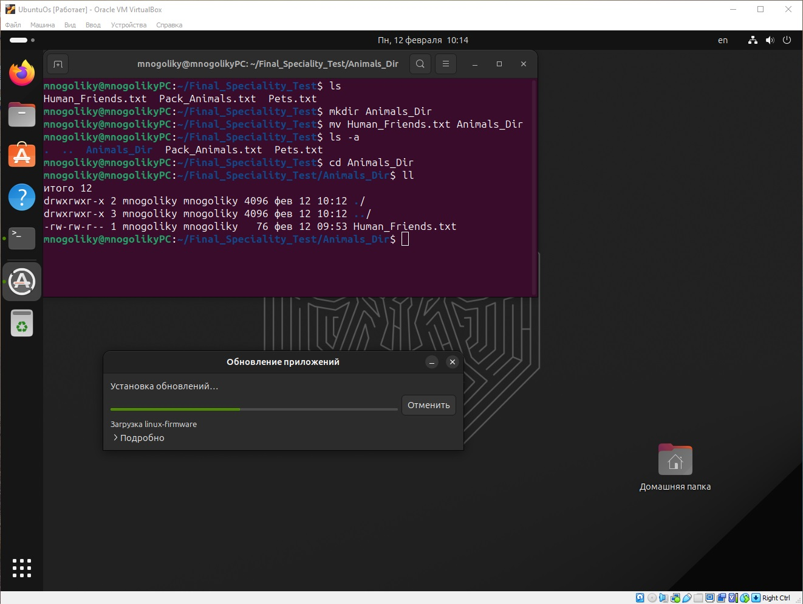

# Итоговая контрольная работа по блоку специализация (Николай Гаврилов, февраль 2024 года)

__Информация о проекте__

Необходимо организовать систему учета для питомника в котором живут
домашние и Pack animals.
___
## Задание

### Операционные системы и виртуализация (Linux)
\
__1. Использование команды cat в Linux__

Создать два текстовых файла: "Pets"(Домашние животные) и "Pack
animals"(вьючные животные), используя команду `cat` в терминале Linux. В
первом файле перечислить собак, кошек и хомяков. Во втором — лошадей,
верблюдов и ослов.
Объединить содержимое этих двух файлов в один и просмотреть его
содержимое.
Переименовать получившийся файл в "Human Friends".
Пример конечного вывода после команды “ls” :
Desktop Documents Downloads HumanFriends.txt Music PackAnimals.txt
Pets.txt Pictures Videos

__2. Работа с директориями в Linux__

Создать новую директорию и переместить туда файл "Human Friends".

__3. Работа с MySQL в Linux. “Установить MySQL на вашу вычислительную
машину”__

Подключить дополнительный репозиторий MySQL и установить один из пакетов из этого репозитория.