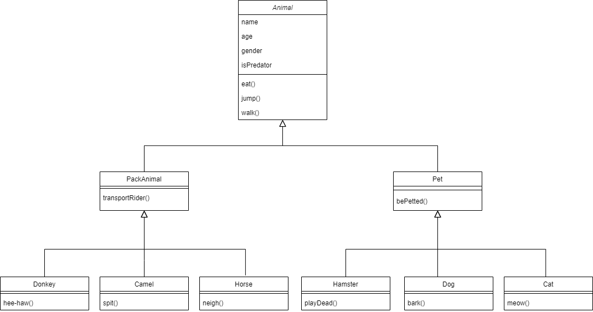

# Итоговая контрольная работа по блоку специализация (Николай Гаврилов, февраль 2024 года)

__Информация о проекте__

Необходимо организовать систему учета для питомника в котором живут
домашние и Pack animals.
___

## Операционные системы и виртуализация (Linux)
\
__1. Использование команды cat в Linux__

Создать два текстовых файла: "Pets"(Домашние животные) и "Pack
animals"(вьючные животные), используя команду `cat` в терминале Linux. В
первом файле перечислить собак, кошек и хомяков. Во втором — лошадей,
верблюдов и ослов.
Объединить содержимое этих двух файлов в один и просмотреть его
содержимое.
Переименовать получившийся файл в "Human Friends".
Пример конечного вывода после команды “ls” :
Desktop Documents Downloads HumanFriends.txt Music PackAnimals.txt
Pets.txt Pictures Videos


__2. Работа с директориями в Linux__

Создать новую директорию и переместить туда файл "Human Friends".


__3. Работа с MySQL в Linux. “Установить MySQL на вашу вычислительную
машину”__

Подключить дополнительный репозиторий MySQL и установить один из пакетов из этого репозитория.


__4. Управление deb-пакетами__

Установить и затем удалить deb-пакет, используя команду `dpkg`.


__5. История команд в терминале Ubuntu__

Сохранить и выложить историю ваших терминальных команд в Ubuntu.

```
mnogoliky@mnogolikyPC:~$ history
    178  mkdir Final_Speciality_Test
    179  cd Final_Speciality_Test
    180  cat > Pets.txt
    181  cat Pets.txt
    182  cat > Pack_Animals.txt
    183  cat Pets.txt Pack_Animals.txt > All_Animals.txt
    184  more All_Animals.txt
    185  mv All_Animals.txt Human_Friends.txt
    186  ls
    187  clear
    188  ls
    189  mkdir Animals_Dir
    190  mv Human_Friends.txt Animals_Dir
    191  ls - a
    192  cd Animals_Dir
    193  ll
    194  history
    195  clear
    196  wget -c https://dev.mysql.com/get/mysql-apt-config_0.8.16-1_all.deb
    197  sudo dpkg -i mysql-apt-config_0.8.16-1_all.deb
    198  sudo apt update
    199  sudo apt-get install mysql-server
    200  sudo mysql_secure_installation
    201  sudo systemctl status mysql
    202  history
    203  sudo mysql
    204  exit
    205  history
    206  clear
    207  wget http://archive.ubuntu.com/ubuntu/pool/universe/m/mc/mc_4.8.24-2ubuntu1_amd64.deb
    208  sudo dpkg -i mc_4.8.27-1_amd64.deb
    209  sudo apt install -f
    210  sudo dpkg -r mc
    211  history
```
В формате: Файла с ФИО, датой сдачи, номером группы(или потока)

___
## Объектно-ориентированное программирование

__6. Диаграмма классов__

Создать диаграмму классов с родительским классом "Животные", и двумя
подклассами: "Pets" и "Pack animals".
В составы классов которых в случае Pets войдут классы: собаки, кошки,
хомяки, а в класс Pack animals войдут: Лошади, верблюды и ослы.
Каждый тип животных будет характеризоваться (например, имена, даты
рождения, выполняемые команды и т.д)
Диаграмму можно нарисовать в любом редакторе, такими как Lucidchart,
Draw.io, Microsoft Visio и других.



__7. Работа с MySQL (Задача выполняется в случае успешного выполнения
задачи “Работа с MySQL в Linux. “Установить MySQL на вашу машину”)__

7.1 После создания диаграммы классов в 6 пункте, в 7 пункте база данных
"Human Friends" должна быть структурирована в соответствии с этой
диаграммой. Например, можно создать таблицы, которые будут
соответствовать классам "Pets" и "Pack animals", и в этих таблицах будут поля, которые характеризуют каждый тип животных (например, имена, даты
рождения, выполняемые команды и т.д.).

7.2 В ранее подключенном MySQL создать базу данных с названием
"Human Friends".
- Создать таблицы, соответствующие иерархии из вашей диаграммы
классов.
- Заполнить таблицы данными о животных, их командах и датами
рождения.
- Удалить записи о верблюдах и объединить таблицы лошадей и ослов.
- Создать новую таблицу для животных в возрасте от 1 до 3 лет и вычислить
их возраст с точностью до месяца.
- Объединить все созданные таблицы в одну, сохраняя информацию о
принадлежности к исходным таблицам.